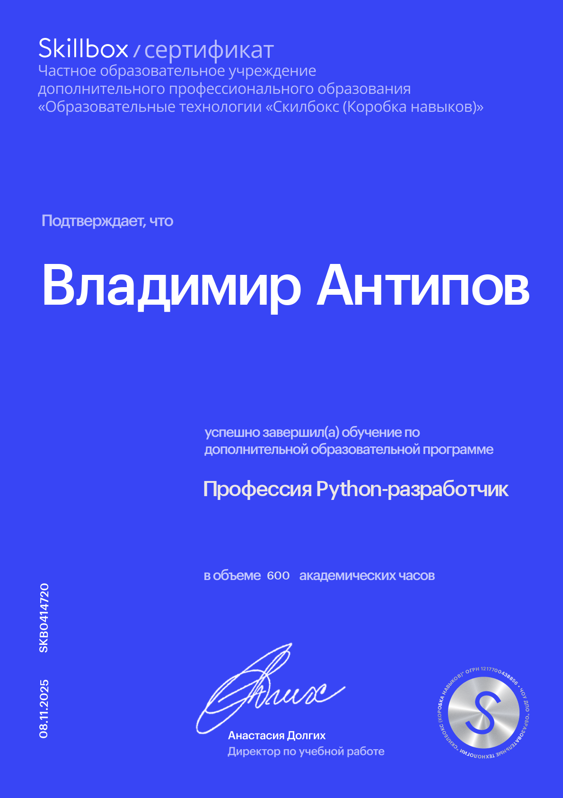

# Архив IT сертификатов

Этот репозиторий содержит структурированный архив моих профессиональных сертификатов и достижений в области программирования и IT. Он отражает мою приверженность постоянному обучению и развитию навыков.

Стремление к развитию и интерес к технике у меня с детства. Еще в дошкольном возрасте я испытывал неподдельное любопытство к электронике: изучал, как все устроено изнутри, и уже тогда понял, что свяжу свою профессиональную деятельность с электротехнихой.

После школы я с отличием окончил Профессиональный лицей, получив диплом по профессии «электромонтер по ремонту и обслуживанию электрооборудования» с присвоением повышенного 4-го разряда. Параллельно прошел обучение в РОСТО (ДОСААФ) по специальности «специалист электротехнических средств заграждения и сигнализации».

После службы в армии я продолжил работать в сфере энергетики, постоянно оттачивая свое мастерство: занимался сборкой серверных стоек и шкафов управления, а также монтажом подстанций 110 кВ. Интерес к смежным областям позволил мне приобрести разнообразные навыки, включая ремонт электроники и бытовой техники, а также прошивку микросхем.

Мой путь в IT начался в начале 2000-х с самостоятельного изучения программирования, компьютерного «железа» и ПО, что мне давалось легко. Языки и технологии которые я изучал: Delphi, HTML, CSS, PHP, JavaScript, дизассемблирование и отладка с помощью OllyDbg и SoftIce.

Разработал и поддерживал несколько сайтов. С миграцией с HTML на PHP сайта "Электромонтажные работы" мной реализован онлайн-калькулятор стоимости работ с системой скидок.

Завершив курсы на Stepik и в Skillbox («Профессия Python-разработчик»), разработал программу для органов прокуратуры, которая используется антикоррупционными подразделения в ходе проверок исполнения законодательства о противодействии коррупции.

В настоящее время обучаюсь в ВУЗе на факультете информационных технологий по направлению «Информационная безопасность», что позволит мне углубить и систематизировать свои знания.

## Организация

Сертификаты организованы по двум основным категориям:

### По годам
- 22: Сертификаты, полученные в 2022 году
- 25: Сертификаты, запланированные или полученные в 2025 году
- 26: Сертификаты, запланированные или полученные в 2026 году

### По направлениям
- Python
- SQL
- Веб разработка
- Docker
- Django
- Анализ данных
- Статистика
- Data Science
- Машинное обучение
- Английский язык
- C#

## Примеры сертификатов

В некоторых папках присутствуют файлы сертификатов в формате PDF и изображениях. Например:
- certs_by_year/22/stepik-certificate-58852-fd6cea6eng.pdf
- certs_by_direction/Python/skillbox_py_dev.png
- certs_by_direction/English_Language/duolingo-ce5ee025.jpg

Вы можете просматривать директории, чтобы найти сертификаты, отсортированные по годам и направлениям.

---

Репозиторий будет обновляться новыми сертификатами.

---

